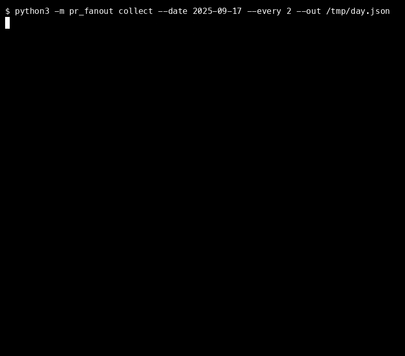
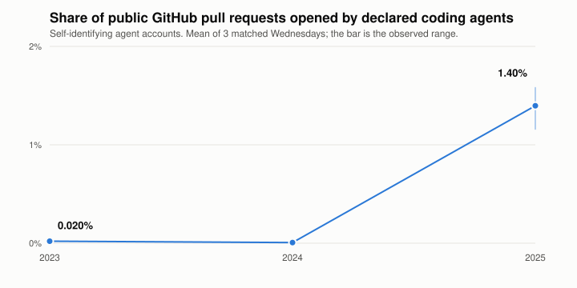
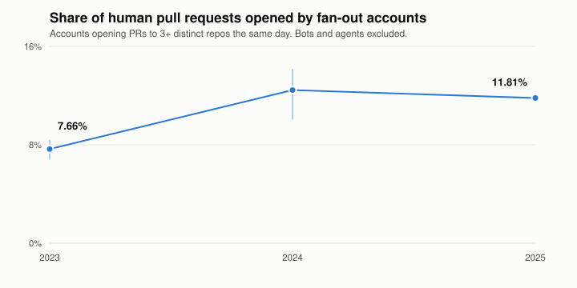

# pr-fanout



**How much of public GitHub is actually agents?** Measured from the public event
stream, reproducibly, without classifying anyone's code as AI-written.

> **This measures behaviour, not people.** Fan-out is an observation, not a verdict
> on a contributor, and nothing here scores, ranks, or gates anyone. No login of a
> natural person appears in any output — see [what is never published](docs/METHODOLOGY.md#what-is-never-published).

---

## Declared coding agents: 0.02% → 1.40% in two years

<picture>
  <source media="(prefers-color-scheme: dark)" srcset="docs/agents-dark.svg">
  
</picture>

Roughly a **70×** rise — and still **about one pull request in seventy**. Both halves
of that sentence are the finding. The three sampled days of 2025 fall in 1.16–1.58%,
a range that does not come near either earlier year.

Almost all of it is one account. On 2025-09-17, of 1,175 agent-opened pull requests:
**Copilot 1,097**, devin-ai-integration 53, codegen-sh 11.

This is a **floor**, not a ceiling: it counts only agents that announce themselves.
An agent driven from a personal access token is indistinguishable from its owner —
which is what the second metric is for.

## Fan-out: a step in 2024, flat since

<picture>
  <source media="(prefers-color-scheme: dark)" srcset="docs/fanout-dark.svg">
  
</picture>

An account is a **fan-out submitter** if it opens pull requests against 3 or more
distinct repositories in the same day. Reading three unfamiliar codebases in a day
and producing a correct patch for each is near the limit of what a person does, and
trivially what a loop does — so this catches breadth without depth, with no detector
to game.

It rose between 2023 and 2024 and has been flat since. **It is not still climbing**,
and 2024's spread (10.1–14.11%) is wide enough that even the size of the step is
uncertain.

Most accounts touch exactly one repository. On 2025-09-17: **28,671** accounts at one
repo, 302 at three or more, and **2** above fifty.

## The whole dataset

| UTC day | human PRs | bot PRs | agent PRs | % by agents | % human PRs from fan-out |
|---|---|---|---|---|---|
| 2023-09-06 | 53,112 | 23,469 | 14 | 0.02 | 8.33 |
| 2023-09-13 | 55,569 | 23,044 | 25 | 0.03 | 7.79 |
| 2023-09-20 | 56,412 | 20,285 | 10 | 0.01 | 6.85 |
| 2024-09-04 | 57,630 | 30,190 | 3 | 0.00 | 10.10 |
| 2024-09-11 | 63,382 | 29,181 | 6 | 0.01 | 14.11 |
| 2024-09-18 | 70,132 | 31,055 | 10 | 0.01 | 13.13 |
| 2025-09-03 | 44,955 | 27,223 | 1,064 | 1.45 | 11.66 |
| 2025-09-10 | 43,247 | 56,804 | 1,171 | 1.16 | 11.89 |
| 2025-09-17 | 46,840 | 26,409 | 1,175 | 1.58 | 11.87 |

Twelve hours of each day (every second hour), three matched Wednesdays per year so
weekday and season cannot move between comparison points. Raw output in
[`data/`](data/), including the per-repository tables and the count of repositories
the small-cell floor excluded from them.

**Why three days and not one.** On **2025-09-10**, `dependabot[bot]` opened **15,885
pull requests across 15,782 distinct repositories in one hour** — a single security
advisory fanning out. The same hour on the Wednesdays either side carried 893 and
2,226. A one-day sample landing there would have reported bots overtaking humans.
Any single-day figure from this dataset is untrustworthy by construction.

2026 is collected and **excluded from every claim**: those archive hours arrive with a
trimmed payload and a fraction of the event volume. The collector marks them
`"all_hours_full_schema": false` and the report refuses to plot them, so the exclusion
is mechanical rather than a judgement call.

## Run it yourself

```bash
git clone https://github.com/testofschool/pr-fanout && cd pr-fanout
PYTHONPATH=src python3 -m pr_fanout collect --date 2025-09-17 --every 2 --out /tmp/day.json
PYTHONPATH=src python3 -m pr_fanout report --inputs '/tmp/day.json' --out /tmp/report
```

No API key, no GitHub token, no dependencies — the standard library and
[GH Archive](https://www.gharchive.org/). `--threshold` moves the fan-out cut and
every run prints the sweep at 2/3/4/5/10 so you can read the number at your own cut
instead of taking 3 on faith. `--min-cell` sets the suppression floor.

`make all` reproduces every number above from scratch.

## Before you cite this

- [`docs/METHODOLOGY.md`](docs/METHODOLOGY.md) — what is measured, what is never
  published, and the two archive traps that silently corrupt this kind of work.
- [`docs/LIMITATIONS.md`](docs/LIMITATIONS.md) — **read this one.** Three days a year
  is a range, not a confidence interval. Fan-out has known false positives (release
  engineers, upstream security fixes, event weeks). The agent list can only name
  agents that already exist.
- [`PRODUCT_LOGIC_SPEC.md`](PRODUCT_LOGIC_SPEC.md) — the collector's behaviour
  contract: request ownership, schema probing, and five replayed traces.

An earlier revision of this repository computed the fan-out share from distinct
repositories instead of pull requests. It was wrong, it is fixed, the regression is
pinned in the test suite, and every dataset was re-collected. That correction is
recorded in the methodology rather than quietly overwritten.

## Contributing

Issues that disagree with a number are the most useful thing you can send. Bring the
day, the command, and what you got.

MIT.
